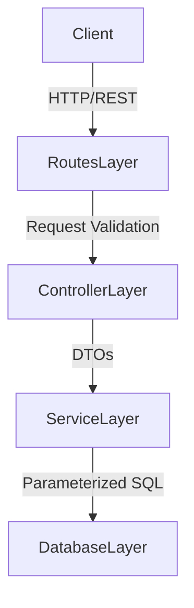

# Architecture & Technical Implementation

> **Author's Note:** When designing the architecture for this application, I prioritized separation of concerns, scalability, and robust concurrency management. This document outlines the technical decisions from a senior engineering perspective.

## 1. System Architecture

The platform is designed as a decoupled Client-Server application, adhering to modern web development standards.

- **Frontend**: A React-based Single Page Application (SPA), utilizing Vite for optimized bundling and hot module replacement.
- **Backend**: A Node.js/Express REST API serving as a stateless intermediary.
- **Data Layer**: PostgreSQL, chosen for its ACID compliance and advanced locking mechanisms, essential for concurrency control.

## 2. Backend Design: Layered N-Tier Architecture

The backend strictly follows a layered architectural pattern to decouple transport logic from business rules.

### Layer Breakdown
- **Routes Layer**: Handles route definitions and applies middleware (JWT authentication, role authorization, rate limiting).
- **Controller Layer**: Responsible solely for HTTP context (`req`, `res`). It extracts parameters and formats responses, delegating all logic to the services.
- **Service Layer**: The domain core. It encapsulates 100% of the business logic, transaction boundaries, and algorithmic complexity (e.g., the auto-assignment logic).
- **Data Access Layer**: Manages connection pooling and executes parameterized SQL queries, abstracting the raw database driver interactions.

## 3. Key Technical Decisions

### Relational Database vs. NoSQL
PostgreSQL was selected over NoSQL alternatives because the domain model is inherently relational (Users own Leads, Leads generate Logs). Furthermore, the core requirement of concurrent lead assignment demands robust transactional locking (`FOR UPDATE SKIP LOCKED`), which PostgreSQL handles exceptionally well.

### Raw SQL over ORMs
I opted for parameterized raw SQL queries using the `pg` driver rather than a heavy ORM. This eliminates the "N+1 query" problem often introduced by ORMs and provides absolute control over query execution plans and database locks, which is vital for performance at scale.

### Stateless Authentication
Authentication is managed via stateless JSON Web Tokens (JWT). By embedding the user's ID and role in the cryptographically signed payload, we eliminate the need for session lookups on every request, allowing the API to scale horizontally across multiple instances without shared session state.

## 4. Handling Concurrency: The Auto-Assignment Engine

One of the most complex engineering challenges in this system is assigning newly created leads to the least-loaded agent in a highly concurrent environment.

**The Race Condition:**
If two managers create leads simultaneously, a naive `SELECT COUNT(*)` would identify the same "least loaded" agent for both leads, resulting in an uneven distribution.

**The Solution:**
I implemented a robust concurrency control mechanism using PostgreSQL's advanced transactional features. The Service layer executes a transaction utilizing `FOR UPDATE SKIP LOCKED`:
1. It queries the agents ordered by their active lead count.
2. It attempts to acquire an exclusive row lock on the selected agent.
3. If another transaction holds the lock, `SKIP LOCKED` instructs the database to immediately evaluate the *next* agent instead of blocking.
4. This guarantees that concurrent requests will smoothly and evenly distribute leads without deadlocks or race conditions.
