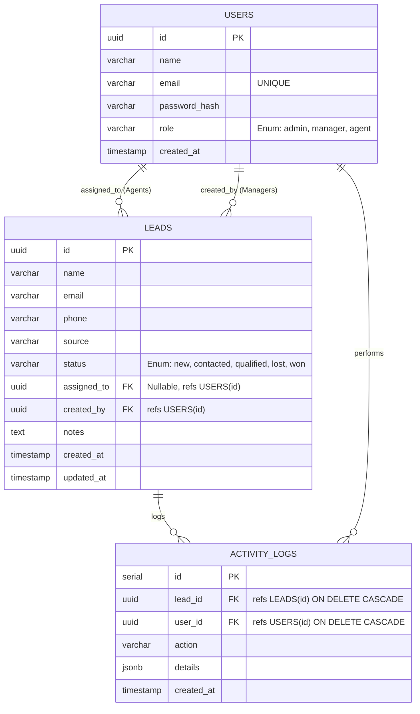

# Database Design Document

> **Author's Note:** As a senior engineer, I approach database design with a focus on data integrity, scalability, and performance. The schema below reflects a normalized relational model optimized for the specific access patterns of a Lead Management System.

## Entity-Relationship (ER) Diagram

## Schema Architecture & Trade-offs

### 1. `users` Table
The `users` table acts as the central authentication and authorization authority.
- **Primary Key Strategy**: UUIDv4 is used to prevent enumeration attacks and ensure global uniqueness, which is critical for distributed systems.
- **Data Integrity**: The `email` column enforces a `UNIQUE` constraint at the database level.
- **Security**: Passwords are securely hashed using bcrypt (`password_hash`), meaning plaintext credentials never touch the database.
- **Authorization**: The `role` column enforces strict Domain boundaries via a `CHECK (role IN ('admin', 'manager', 'agent'))` constraint.

### 2. `leads` Table
The `leads` table manages the core business entity. It is highly normalized to prevent update anomalies.
- **Foreign Keys**: It maintains referential integrity with the `users` table via `assigned_to` and `created_by`. 
- **Nullable Assignments**: The `assigned_to` field is intentionally nullable to support unassigned lead queues, allowing the system to scale into dynamic pull-based routing in the future.
- **State Machine**: The `status` field represents a strict finite state machine, enforced by database-level constraints `CHECK (status IN ('new', 'contacted', 'qualified', 'lost', 'won'))`.
- **Auditability**: `created_at` and `updated_at` timestamps are maintained for reporting and Service Level Agreement (SLA) monitoring.

### 3. `activity_logs` Table
An append-only audit log for tracking system events, crucial for compliance and debugging.
- **Performance Optimization**: Unlike the core entity tables, this table uses a `SERIAL` (auto-incrementing integer) primary key. Since logs are inserted at a high frequency and rarely queried individually by ID, an integer sequence provides optimal insert performance and reduces B-Tree index fragmentation.
- **Referential Integrity**: Implements `ON DELETE CASCADE` for both `lead_id` and `user_id` to prevent orphaned records and maintain a clean database state.
- **Extensibility**: The `details` column uses the `JSONB` data type. This is a deliberate choice to allow schema-less event metadata (e.g., specific field changes) without requiring expensive schema migrations as new event types are introduced.
